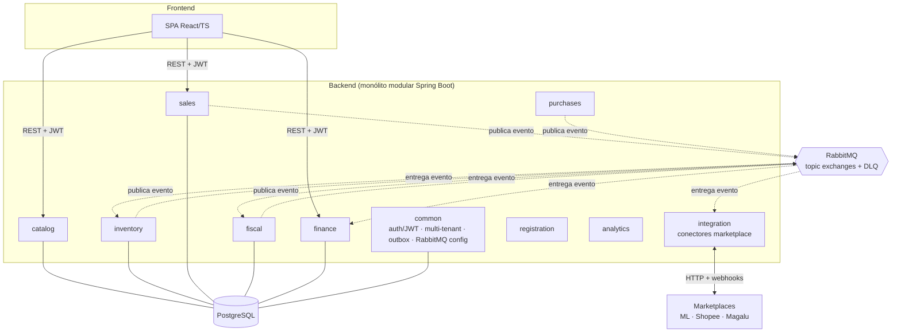
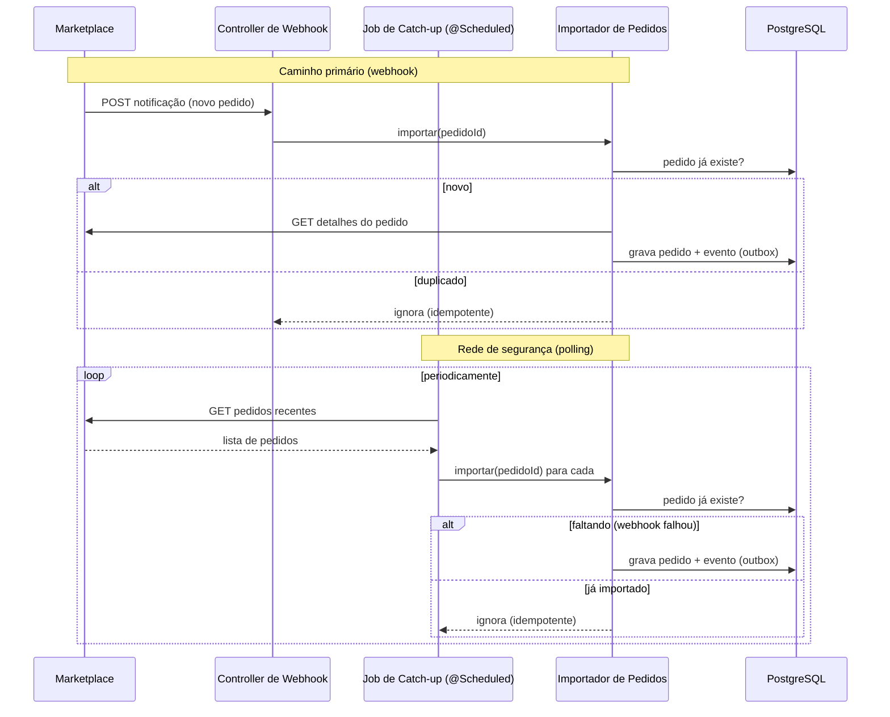

# ERP Multicanal para E-commerce — Backend Java

Backend de um ERP que centraliza a operação de um e-commerce multicanal (catálogo, estoque, compras, vendas, fiscal e financeiro), integrando marketplaces e vendas B2B em um único sistema.

> **Observação sobre este repositório:** o código-fonte é **privado** por conter regras de negócio de um cliente real. Este documento descreve a **arquitetura e as decisões técnicas** do projeto de forma genérica, sem expor dados, credenciais ou regras proprietárias. Ver a [nota final](#12-sobre-o-código-fonte).

---

## 1. Visão geral

Operar um e-commerce que vende em vários canais ao mesmo tempo cria um problema central: **um único estoque físico precisa abastecer vários marketplaces e um fluxo de venda B2B simultaneamente**, sem vender o mesmo item duas vezes (oversell) e sem que a operação vire um emaranhado de planilhas e painéis separados por canal.

Este sistema resolve isso concentrando em um só backend:

- **Catálogo** em três níveis (Categoria → Produto → SKU), sendo o SKU a unidade de estoque e venda.
- **Estoque único** por SKU, compartilhado entre todos os canais.
- **Integração com três marketplaces brasileiros** — Mercado Livre, Shopee e Magalu — para ingestão de pedidos, sincronização de estoque e perguntas.
- **Vendas B2B** com pedido manual e emissão própria de NF-e.
- **Fiscal** (importação/vínculo de NF-e emitidas pelos canais + emissão própria) e **financeiro** (contas a pagar, fluxo de caixa, DRE, repasse de marketplace).

**Escala e porte (do próprio código):** monólito modular com **11 módulos Maven** (~24,5 mil linhas de Java em `src/main`), **198 endpoints REST** em 42 controllers, **80 migrações de banco** versionadas e **multi-tenant** (um mesmo deploy atende vários clientes isolados por linha). O modelo de catálogo/estoque foi desenhado para operar com catálogos de milhares de SKUs e múltiplos canais simultâneos.

---

## 2. Stack

| Tecnologia | Versão | Para que é usada |
|---|---|---|
| Java | 21 | Linguagem base |
| Spring Boot | 3.3.6 | Web, Data JPA, Security, Validation, AMQP |
| PostgreSQL | 17 (dev) | Banco relacional único |
| Flyway | (gerenciado pelo Spring Boot) | Migrações de schema versionadas (80 scripts `V*.sql`) |
| Hibernate ORM | (via Spring Data JPA) | Persistência + **multi-tenancy por discriminador** (`@TenantId`) |
| RabbitMQ | 3.x | Barramento de eventos entre módulos (Spring AMQP) |
| jjwt (JSON Web Token) | 0.12.6 | Autenticação stateless com access + refresh token |
| Lombok | — | Redução de boilerplate |
| OWASP dependency-check | (plugin Maven) | Verificação de vulnerabilidades em dependências |
| React + TypeScript + Vite + Ant Design | 18 / 5 / 6 / 6 | Frontend (SPA) |

Dependências **declaradas mas ainda não exercitadas** no código: **Resilience4j 2.2.0**, **Testcontainers 1.20.4** e **WireMock 3.9.2** — ver [seção 9](#9-estratégia-de-testes) para o porquê. São citadas aqui por honestidade: constam no `pom.xml`, mas nenhuma classe as utiliza hoje.

---

## 3. Arquitetura

O sistema é um **monólito modular**: todos os módulos rodam no mesmo processo Spring Boot, mas com fronteiras explícitas de dependência definidas no Maven. A comunicação **entre módulos de domínio** é assíncrona, por eventos, passando por um **Transactional Outbox + RabbitMQ** — não por chamada direta de service para service.

Cada módulo segue camadas convencionais: `controller` (REST) → `service` (regra de negócio) → `repository` (Spring Data JPA) → entidades de domínio. Onde há acoplamento entre domínios (ex.: `sales` precisa de dados de integração), usa-se **ports** definidos no módulo consumidor e **adapters** implementados no módulo provedor, mantendo a direção de dependência estável (`integration → sales → common`).



**Módulos (por porte de código):**

| Módulo | ~Linhas (main) | Responsabilidade |
|---|--:|---|
| `integration` | 7.800 | Conectores de marketplace, webhooks, jobs de polling, sync de estoque/preço |
| `fiscal` | 3.800 | NF-e: importação/vínculo + emissão própria (B2B) |
| `sales` | 3.200 | Pedidos, importação de pedidos de marketplace, listeners de eventos |
| `common` | 2.200 | Transversal: auth/JWT, multi-tenancy, outbox, config RabbitMQ, auditoria |
| `purchases` | 1.600 | Compras e importação de XML de nota de entrada |
| `catalog` | 1.600 | Categoria/Produto/SKU e mapeamentos de plataforma |
| `finance` | 1.400 | Contas a pagar, despesas, fluxo de caixa/DRE |
| `registration` | 1.200 | Fornecedores e clientes |
| `analytics` | 1.000 | Dashboards de vendas/margem |
| `inventory` | 600 | Estoque com controle de concorrência |
| `app` | 75 | Bootstrap/agregador |

---

## 4. Decisões técnicas e trade-offs

### 4.1. Monólito modular em vez de microserviços

- **Problema:** o domínio tem vários subdomínios (catálogo, estoque, vendas, fiscal, financeiro, integração) que precisam de fronteiras claras, mas o projeto é operado por uma equipe pequena.
- **Alternativas:** microserviços independentes; monólito "espaguete" sem fronteiras; monólito modular.
- **Escolha:** **monólito modular** — módulos Maven separados, com dependências direcionadas e comunicação por eventos, tudo em um processo.
- **Por quê:** ganha-se separação de responsabilidades e a possibilidade futura de extrair um módulo, sem pagar o custo operacional de microserviços (rede, orquestração, observabilidade distribuída, transações distribuídas) numa fase que não precisa disso.
- **Custo:** um deploy único (uma falha grave derruba tudo); a disciplina das fronteiras depende de convenção + revisão, não de isolamento físico; escala apenas verticalmente/por réplica do processo inteiro.

### 4.2. Comunicação entre módulos por Transactional Outbox + RabbitMQ

- **Problema:** quando um módulo muda estado (ex.: confirma um pedido), outros precisam reagir (reservar estoque, preparar fiscal). Fazer isso com chamada síncrona direta acopla os módulos e cria o risco clássico de "gravou no banco mas o aviso se perdeu" (ou o inverso).
- **Alternativas:** chamada direta de service; publicar direto no broker dentro da transação (dual-write, sujeito a inconsistência); eventos in-process do Spring; outbox transacional.
- **Escolha:** **Transactional Outbox.** O evento é gravado numa tabela `outbox` **no mesmo commit** da operação de negócio; um `OutboxPoller` (`@Scheduled`, ~500ms) lê os pendentes e publica no RabbitMQ (um _topic exchange_ por domínio — vendas, estoque, fiscal, compras, financeiro), com **DLQ + retry** por fila.
- **Por quê:** garante atomicidade entre "mudou o estado" e "vai avisar" (sem dual-write); desacopla produtor e consumidor; entrega *at-least-once* com dead-letter para falhas.
- **Custo:** latência de até um ciclo de polling; consumidores precisam ser **idempotentes** (at-least-once pode reentregar); há um poller varrendo o banco periodicamente. Para coordenação leve e local, o projeto ainda usa eventos in-process do Spring (`ApplicationEventPublisher`), convivendo com o barramento.

### 4.3. Multi-tenancy por discriminador (coluna `tenant_id`)

- **Problema:** o mesmo deploy precisa atender múltiplos clientes com isolamento de dados, sem multiplicar a infraestrutura.
- **Alternativas:** um banco por tenant; um schema por tenant; discriminador (coluna) em schema compartilhado.
- **Escolha:** **discriminador** via `@TenantId` do Hibernate — todas as entidades multi-tenant estendem uma `@MappedSuperclass` com a coluna `tenant_id`; o Hibernate injeta o filtro automaticamente em todas as queries. O tenant é resolvido do JWT por um `TenantFilter` que popula um `TenantContext` (ThreadLocal).
- **Por quê:** menor custo operacional (um banco, um pool, uma migração), e o filtro automático reduz o risco de "vazar" dados entre tenants por esquecimento numa query.
- **Custo:** isolamento **lógico**, não físico (todos os tenants no mesmo banco); depende de o `TenantContext` estar sempre setado — daí a atenção especial em pontos fora do fluxo HTTP (consumidores de fila restauram o tenant a partir do header da mensagem).

### 4.4. Prevenção de oversell com lock pessimista

- **Problema:** com estoque único compartilhado entre canais, duas baixas concorrentes no mesmo SKU podem vender além do disponível.
- **Alternativas:** lock otimista (`@Version` + retry); lock pessimista (`SELECT … FOR UPDATE`); serializar por fila.
- **Escolha:** **lock pessimista** — o repositório de posição de estoque usa `@Lock(LockModeType.PESSIMISTIC_WRITE)` ao ler a linha do SKU durante reserva/baixa, garantindo exclusão mútua na linha até o commit.
- **Por quê:** a operação de estoque é curta e o custo de um conflito (oversell) é alto; o lock pessimista evita o laço de retry do otimista sob concorrência real no mesmo item.
- **Custo:** contenção se muitos pedidos disputam o mesmo SKU (as transações serializam naquela linha); exige manter as transações de estoque curtas para não segurar o lock. Detalhe de ciclo de vida do domínio: pedido de marketplace entra sem reservar e a baixa efetiva ocorre no despacho, o que reduz a janela de contenção.

### 4.5. Ingestão de pedidos redundante: webhook + catch-up por polling

- **Problema:** webhooks de marketplace **não são confiáveis** — podem atrasar, falhar ou não disparar (em sandbox, alguns nem disparam). Perder um pedido é inaceitável.
- **Alternativas:** só webhook (rápido, mas frágil); só polling (confiável, mas custoso e com latência); os dois combinados.
- **Escolha:** **webhook como caminho primário + jobs `@Scheduled` de catch-up/reconciliação** como rede de segurança. Há controllers de notificação (Mercado Livre, Shopee) e jobs agendados de polling (`MercadoLivreOrderReconcileJob`, `ShopeeOrderPollingJob`, `MagaluOrderPollingJob`, `MarketplaceInvoicePollingJob`, `MLQuestionPollingTask`) + um `OrderCatchupRunner`. Ver [seção 5](#5-pipeline-de-integração-com-marketplaces).
- **Por quê:** o webhook dá latência baixa no caso normal; o polling garante que nada se perca no caso de falha, buscando o que o webhook não trouxe.
- **Custo:** complexidade (dois caminhos para a mesma coisa) e necessidade de **idempotência** — o mesmo pedido pode chegar pelos dois caminhos e não pode ser importado em duplicata.

### 4.6. Autenticação stateless com refresh token persistido

- **Problema:** autenticar uma SPA sem sessão de servidor, mantendo os tokens curtos por segurança, mas sem exigir login a cada poucos minutos.
- **Alternativas:** sessão server-side; só um JWT longo (inseguro se vazar); access token curto + refresh token.
- **Escolha:** **access token JWT curto** (enviado no corpo/`Authorization`) + **refresh token em cookie `httpOnly`**, com o refresh persistido no banco (entidade `RefreshToken`) para permitir rotação/revogação.
- **Por quê:** access curto limita o dano de um vazamento; refresh em cookie `httpOnly` fica fora do alcance de JavaScript (mitiga XSS); persistir o refresh permite invalidá-lo no logout/rotação.
- **Custo:** o refresh no banco reintroduz um ponto de estado (não é 100% stateless); é preciso cuidar de CSRF no fluxo de cookie e da renovação concorrente de token no cliente.

---

## 5. Pipeline de integração com marketplaces

A ingestão de pedidos usa dois caminhos que se complementam:

1. **Webhook (primário).** O marketplace chama um endpoint de notificação; o sistema valida, registra e dispara a importação do pedido. Baixa latência no caminho feliz.
2. **Catch-up por polling (rede de segurança).** Jobs agendados consultam periodicamente a API do marketplace atrás de pedidos/notas/perguntas que o webhook não trouxe, e importam o que estiver faltando.

A **idempotência** é o que torna a redundância segura: cada pedido é identificado pelo seu ID no marketplace, então chegar pelos dois caminhos não gera duplicata — o segundo a chegar é reconhecido como já importado.



---

## 6. Controle de estoque

O estoque é **único por SKU** e compartilhado por todos os canais — não há saldo separado por marketplace. Isso elimina o problema de estoques desencontrados, mas concentra a concorrência: várias vendas podem tentar baixar o mesmo SKU ao mesmo tempo.

**Estratégia de concorrência:** **lock pessimista de escrita** (`@Lock(LockModeType.PESSIMISTIC_WRITE)`) na posição de estoque. Ao reservar ou baixar, a transação faz um `SELECT … FOR UPDATE` na linha do SKU, obtendo exclusão mútua até o commit. Duas operações concorrentes no mesmo SKU serializam; operações em SKUs diferentes seguem em paralelo.

Para reduzir a janela de contenção, o ciclo de vida do pedido de marketplace **não reserva estoque na importação** — a baixa efetiva acontece quando o pedido avança para despachado. O cancelamento libera o que estava reservado, com proteção contra liberar mais do que foi reservado.

---

## 7. Módulo financeiro

O módulo financeiro (e o fiscal, que o alimenta) oferece, de forma genérica:

- **Contas a pagar** — a partir de notas de entrada (compras) e de lançamentos manuais.
- **Despesas** — inclusive recorrentes, materializadas periodicamente por um job agendado.
- **Fluxo de caixa e DRE** — consolidação de entradas e saídas do período e demonstrativo de resultado.
- **Contas a receber / repasse de marketplace** — estimativa do valor líquido de vendas em marketplace (valor bruto menos taxas do canal e frete).
- **Fiscal — importação e conciliação de NF-e** — vínculo das notas que os canais já emitiram aos respectivos pedidos, e **emissão própria de NF-e** para a linha B2B.

> As regras fiscais específicas (tributos, CFOPs, cenários) não são detalhadas aqui por serem particulares do cliente.

---

## 8. Segurança

- **Autenticação JWT stateless.** Access token de vida curta assinado (jjwt), validado por um `JwtAuthenticationFilter` em cada requisição.
- **Refresh token.** Emitido em cookie `httpOnly` e **persistido no banco**, permitindo rotação e revogação (logout invalida o refresh). O access token é renovado sem novo login enquanto o refresh for válido.
- **Isolamento multi-tenant.** Cada requisição autenticada carrega o tenant; um `TenantFilter` popula o `TenantContext`, e o Hibernate aplica automaticamente o filtro por `tenant_id` em todas as queries. Consumidores de eventos (fora do fluxo HTTP) restauram o tenant a partir do cabeçalho da mensagem.
- **Verificação de dependências.** OWASP dependency-check integrado ao build para detectar vulnerabilidades conhecidas nas bibliotecas.

> Esta seção descreve a **abordagem**; detalhes de implementação (segredos, tempos de expiração, chaves) não são expostos.

---

## 9. Estratégia de testes

Números atuais da suíte:

- **507 métodos `@Test`** distribuídos em **120 arquivos** de teste.
- **~29** classes com **Mockito** (`@Mock` / `MockitoExtension`) — testes unitários de serviço, isolando dependências.
- **11** com **`@SpringBootTest`** — testes de integração com contexto Spring completo.
- **9** com **`MockMvc` / `@WebMvcTest`** — testes da camada web (controllers).
- **1** `@DataJpaTest` e **3** classes de integração/E2E de ponta a ponta (`*IT` / `*E2E*IT`).
- O restante são testes unitários puros (JUnit) de lógica de domínio.

**Ferramentas:** **JUnit 5** (execução), **Mockito** (dublês em unitários), **Spring Boot Test / MockMvc** (integração e camada web).

**O que foi priorizado:** lógica de negócio dos serviços (a maior parte dos testes) e os fluxos críticos de integração — importação de pedidos de marketplace, ciclo de vida fiscal e autenticação.

**Limitações conhecidas (honestas):**

- Os testes de **integração (`@SpringBootTest`) rodam contra um PostgreSQL real** (`ddl-auto: validate` + Flyway), **não** contra Testcontainers nem H2. Isso os torna fiéis ao banco de produção, mas **acopla a suíte a um banco provisionado** — não é totalmente auto-contida.
- **Testcontainers, WireMock e Resilience4j constam no `pom.xml` mas ainda não são usados** por nenhuma classe. A evolução natural da suíte seria: Testcontainers para tornar os testes de integração auto-contidos, WireMock para simular as APIs de marketplace nos testes, e Resilience4j para resiliência (circuit breaker/retry) nas chamadas externas. Estão declarados, mas essa evolução ainda não foi feita.

---

## 10. Como executar localmente

Pré-requisitos: **Docker** e **Docker Compose**.

O sistema sobe com três contêineres: aplicação (Spring Boot), PostgreSQL e RabbitMQ.

```yaml
# docker-compose.yml (exemplo)
services:
  postgres:
    image: postgres:17
    environment:
      POSTGRES_DB: ${DB_NAME}
      POSTGRES_USER: ${DB_USER}
      POSTGRES_PASSWORD: ${DB_PASSWORD}
    ports: ["5432:5432"]

  rabbitmq:
    image: rabbitmq:3-management
    environment:
      RABBITMQ_DEFAULT_USER: ${RABBITMQ_USER}
      RABBITMQ_DEFAULT_PASS: ${RABBITMQ_PASSWORD}

  app:
    build: .
    depends_on: [postgres, rabbitmq]
    environment:
      SPRING_DATASOURCE_URL: jdbc:postgresql://postgres:5432/${DB_NAME}
      SPRING_DATASOURCE_USERNAME: ${DB_USER}
      DB_PASSWORD: ${DB_PASSWORD}
      SPRING_RABBITMQ_HOST: rabbitmq
      RABBITMQ_PASSWORD: ${RABBITMQ_PASSWORD}
      JWT_SECRET: ${JWT_SECRET}
    ports: ["8080:8080"]
```

```dotenv
# .env.example — copie para .env e preencha com valores locais
DB_NAME=erp
DB_USER=erp
DB_PASSWORD=troque-me
RABBITMQ_USER=erp
RABBITMQ_PASSWORD=troque-me
JWT_SECRET=uma-chave-secreta-longa-e-aleatoria
# Credenciais de marketplace (OAuth) são configuradas fora do versionamento.
```

```bash
cp .env.example .env      # e edite os valores
docker compose up -d      # sobe postgres, rabbitmq e a aplicação
# App disponível em http://localhost:8080
```

Na primeira subida, o Flyway aplica as 80 migrações automaticamente. As integrações com marketplace exigem credenciais OAuth próprias; sem elas, o sistema opera normalmente nas funções que não dependem de canal externo.

---

## 11. Sobre o código-fonte

O **código-fonte é privado** por conter regras de negócio, dados e configurações de um cliente real. Este repositório contém apenas **documentação**: descreve a arquitetura, as decisões técnicas e os trade-offs do projeto, sem expor credenciais, endpoints reais, dados ou lógica fiscal proprietária.

O objetivo é permitir a avaliação técnica do trabalho — organização em módulos, padrões aplicados (Transactional Outbox, multi-tenancy, controle de concorrência, ingestão redundante), qualidade de testes e clareza das decisões — sem comprometer a confidencialidade do cliente.
